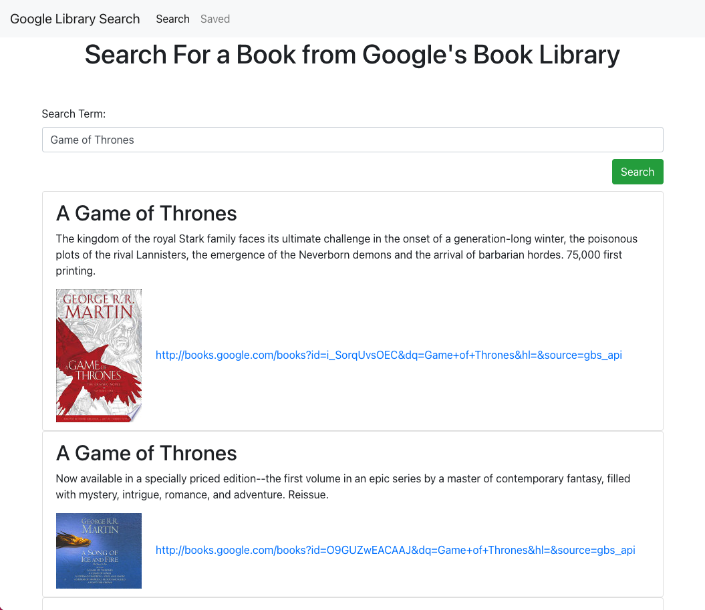

# Google Books Search

## What, Why, and HOW
With this assignment, I was motivated to finish up the bootcamp strong by creating a fullstack MERN application with React. I knew it would be a challenge, but it proved to be even a little trickier than I had anticipated. I've always found front-end to be significantly easier than back-end, and so a part of me was dreading this assignment. As of this point, I'm still not able to fix a bug on the back end. For some reason, I'm able to seed items into the database, but those items aren't appearing on my application. I will do my best to fix this ASAP, but in case this assignment is graded immediately after the due date, I thought I'd make a note of my struggle with completing the back-end. Other than that, creating this application was a lot of fun. I called on the Google Library API correctly and have a working search functionality. To do this (as well as to do the back-end), I:
1. Created a new react app 
2. Pseudo coded so that I knew how to set up my files/folders
3. Figured out how to call upon the Google Library API
4. Called upon the Google Library API to populate the page with search results based on the user's search
5. Created seed data for the database
6. Created all the routes and API calls for the database
7. Attempted to populate the "Saved" page with the items from the database, however, was unable to do so

Although I've ran into a road block with this assignment, I'm really excited to finish it up. I know I'm 90% of the way there, and will get some assistance tomorrow in order to make the final push. The two things I must do in order to fully complete this assignment are:
1. Figure out why the "Saved" page isn't being populated with my database items.
2. Make sure that the "Save" button is adding items to the database.

# Links
Link to GitHub repo: https://github.com/andrew1835/React-Google-Library-Search
 
Link to deployed application: https://andrew-google-library-react.herokuapp.com/
 
Link to updated portfolio: https://andrewreactportfolio.herokuapp.com/

# Screenshot
This screenshot shows what the home/search page looks like after searching "Game of Thrones"

